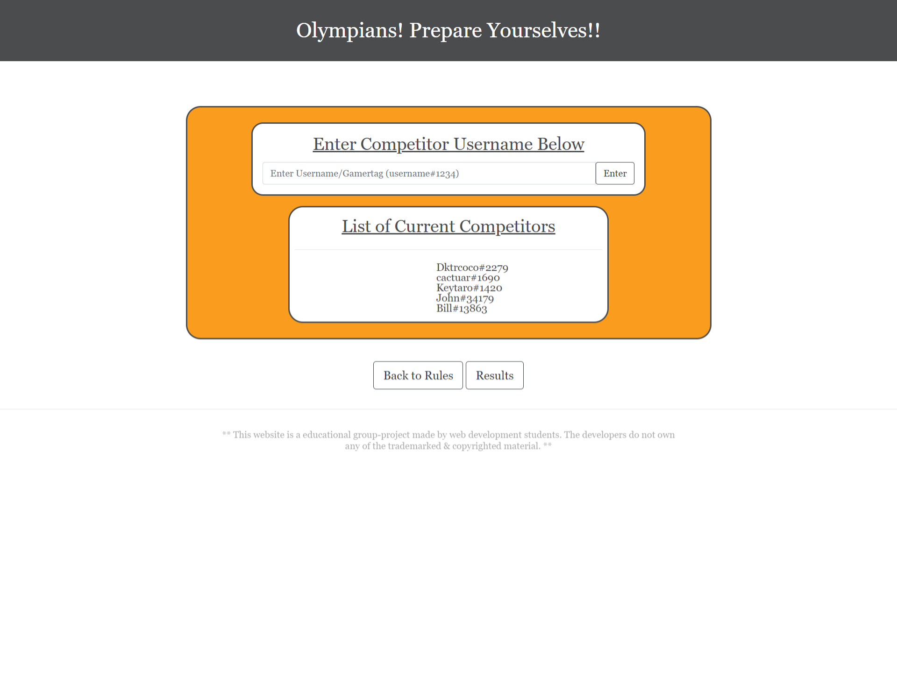

# Gaming Gladiator: Overwatch Olympics

Video of App in Action: 

* Pre-Competition: https://www.youtube.com/watch?v=GRQMeVvSmr4

* Post-Competition: https://www.youtube.com/watch?v=06Exle1HtRs

Link of Deployed App: https://gaminggladiator.herokuapp.com/welcome.html

Link to Heroku Repo: https://dashboard.heroku.com/apps/gaminggladiator

Table of Contents
* [User Story](#story)
* [Games](#games)
* [Images](#images)
* [Gifs](#gifs)
* [Install](#install)
* [Instructions](#instructions)
* [Contribution](#contribution)
* [Authors](#authors)
* [Questions](#questions)
* [Future Work](#future)
* [Retrospective](#retrospective)

## Story

AS a gamer who plays Overwatch, I want have to be able to have in-game challenges

SO I can quickly and easily engage in challenges with other friends who play the game and view the results of the competition

GIVEN a Heroku-deployed app to run a player competition in Overwatch

WHEN I run the app

THEN I see the welcome page that offers a description of the competition

WHEN I navigate to the competition

THEN I am prompted to enter gamertags for myself and my friends

WHEN I enter a gamertag

THEN the gamertag entered is displayed in a list of current competitors

WHEN I navigate to see the results of the competition and click to see results

THEN a bar graph of the number of Gold Medals earned during the duration of the competition are displayed

WHEN I want to end the competition

THEN I can push a 'Reset Competition' button

## Games

First Game: Overwatch Gold Medal Challenge

## Images

Fig. 1: Welcome Page

Fig. 2: Coliseum

Fig. 3: Initial Score

Fig. 4: Competition Results

## Gifs

GIF 1: Navigating Pre-Competition

GIF 2: Navigating to Results

## Install

No installation is required, simply navigate to the deployed app.

If you want to check out the code, you will need to clone the repo and run 'npm install' to ensure the module packages/dependencies are installed.

## Instructions

1. Read competition description on Welcome Page.

2. Enter Coliseum.

3. Enter your Blizzard gamertag (ex: gamertag#1234) and Enter.

4. Repeat with friends with whom you will compete.

5. PLAY OVERWATCH! (This is the best step)

6. Open the app and navigate to Results (button inside Coliseum).

7. Click 'Click for Results!' to generate Results (NOTE: Generating results may take a short amount of time. Do not click Results button more than once.).

8. To end the competition and begin a new one, click 'Reset Competition'. Now you can add players as you did in steps 3 and 4.

## Contribution

Pull requests are welcome. For major changes, please open an issue first to discuss what you would like to change.

Please make sure to update tests as appropriate.

## Authors

Chris Kabana (chris.kabana@gmail.com, https://github.com/dktrcoco)

Christian Vadevoulis (christian.vadevoulis@gmail.com, https://github.com/CVade)

Jeffrey Kornfeld (jakornfeld@yahoo.com, https://github.com/jeffreykornfeld)

Shonta Wilson (swilson9894@gmail.com, https://github.com/swilson9894)

## Questions

If you have any questions that are not answered, please feel free to reach out to any of us at our email (listed above). 

You can also reach us through GitHub directly via our accounts (listed above).

## Future

As our code is structured currently, we will need to implement a limitation to the number of accounts that can be entered into the competition.

Other areas of improvement include:

    *expanding the competition to include other stats besides gold medals

    *adding additional and/or more complex graphs of player stats
    
    *adding a log-in feature

    *allowing the user to select the type of competition (medals, kills, etc)

    *adding in-game sound effects

    *adding a timed functionality to indicate the end of the competition

    *maintaining a list of the current competitors and have it remain between sessions

    *restricting who can add gamers/reset competition based on who is currently in the competition

    *expanding the app to include other games, such as Fortnite, Call of Duty: Modern Warefare, Grand Theft Auto Tournament, Apex Legends, Counter-Strike Go

## Retrospective

* This project was simultaneously very fun and very frustrating. As a member of the back-end team, I struggled frequently to properly utilize Sequelize and creating api routes. When everything finally came together, I had a feeling of great satisfaction. The finished (in terms of this assignment) product is something I can see myself using. The team was a joy to work with. Everyone had good ideas and were enthusiastic about the project. -Chris

* I had a lot of fun with this project, despite not being able to utilize all the ideas we had. I worked on the front-end with Christian where we designed the layout and the bar graph displayed on the results page. Chart JS was an unfamiliar package to us but ended up doing everything we needed it to- aside from some scaling issues we ran into. My team was great to work with, we all connected on our love of video games almost right away, so working on this project was only natural for us. I would love to work with this team again in the future. - Jeffrey

* Test

* Cards on the table, I was very nervous going into the 2nd project. That was quickly forgotten when I found myself in the company of fellow gamers, each with our own strengths & weaknesses, as each of our individual ideas could compliment each other and made it easier to nail down a website/app we knew ideas that other gamers would enjoy. As a member of the front-end team, I worked alongside Jeffrey who I quickly came to trust with his work load because of his work ethic so I could focus on my own workload, and I had complete faith in the back-end team because they were completely on top of their side of the work. Working on this project, while I had my own share of headaches and stress, felt very rewarding both in the end and as I worked on it, which I attribute to working on an idea I really like and because my team was not only very cohesive, but supportive and open-minded to each idea brought forth. I was nervous because of my experiences during the 1st project, but because of my experience here, that is only replaced with confidence in my teammates and in myself. This project is a victory in my book. - Christian - 

